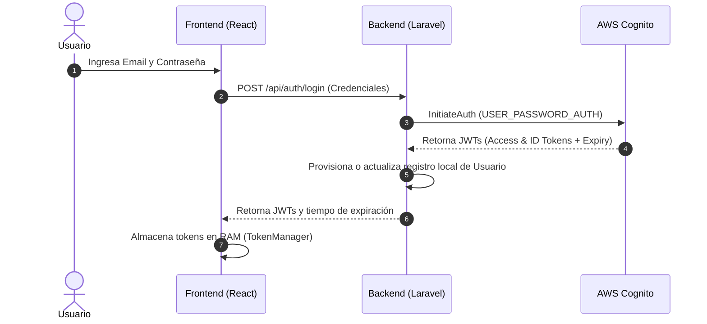
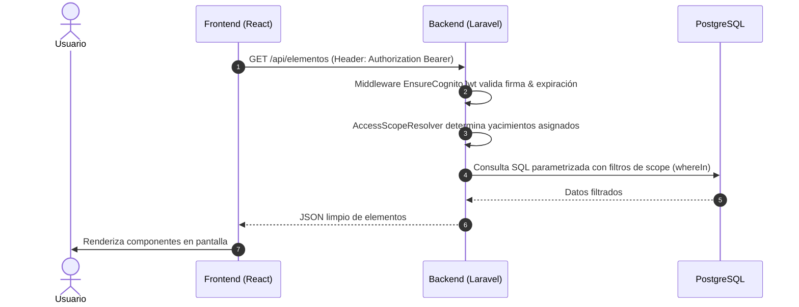
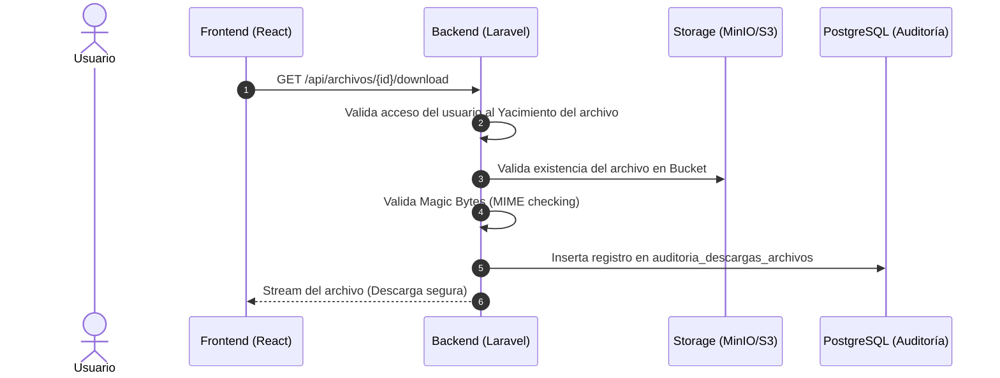
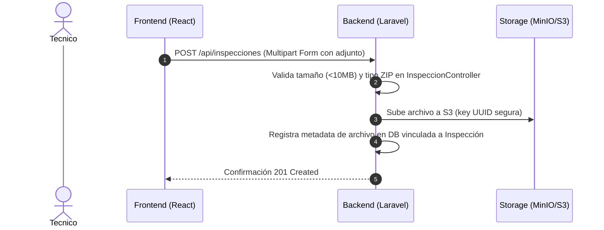
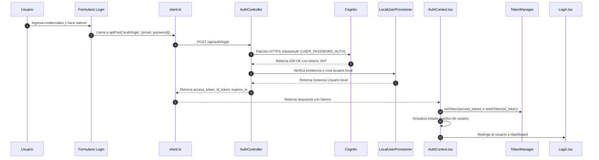
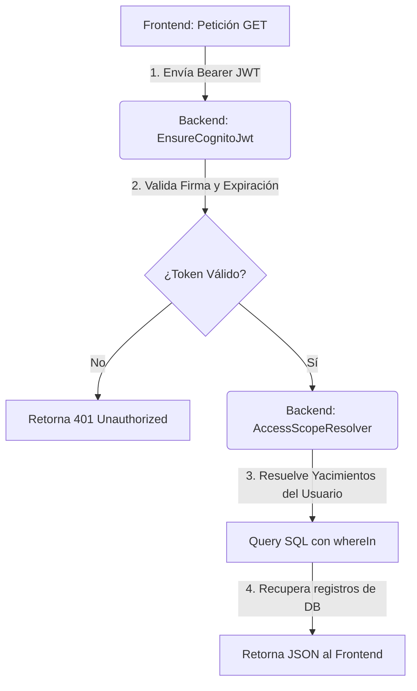
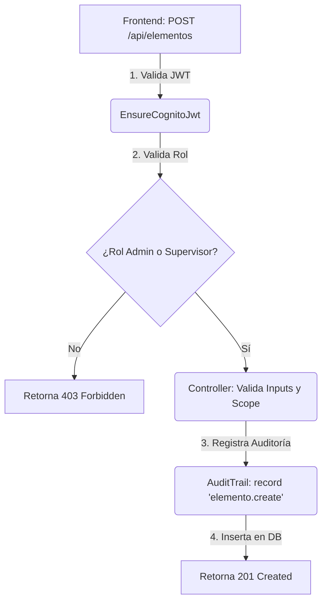

# Auditoría Técnica de Seguridad del Sistema - TermoVault

Este documento constituye una auditoría técnica completa e independiente sobre los controles, arquitectura y configuraciones de seguridad implementadas en la plataforma TermoVault.

---

## 1. Resumen Ejecutivo

TermoVault es una plataforma interna multi-tenant de gestión de informes de termografía en el sector de petróleo y gas (Oil and Gas). Su diseño de seguridad combina un backend Laravel 12 sin estado (*stateless*), un frontend React 19 desacoplado y el proveedor de identidad corporativo **AWS Cognito**.

### Qué Protege el Sistema
- **Informes de Inspección**: Registros técnicos que detallan hallazgos (novedades de temperatura), prioridades térmicas y adjuntos de infraestructura crítica.
- **Activos Físicos (Elementos)**: Subestaciones, seccionalizadores, fusesavers y transformadores de yacimientos.
- **Acceso Multi-tenant**: Aislamiento estricto de datos de forma que un contratista o supervisor solo pueda consultar la información autorizada para su respectiva empresa o yacimiento.

### Cómo se Autentican los Usuarios
La autenticación se delega completamente a **AWS Cognito** mediante el flujo de credenciales del usuario (*User Password Auth*). El backend Laravel actúa como un proxy seguro que no almacena ni contraseñas ni hashes locales. Al autenticarse, Cognito emite tokens web JSON (JWT) auto-contenidos y firmados digitalmente (RS256).

### Cómo se Controlan los Permisos
El sistema implementa dos capas de autorización:
1.  **Rol del Usuario**: Administrado localmente en base de datos (`usuarios.rol_id`). Determina las acciones generales permitidas (crear elementos, cerrar inspecciones, etc.) mediante el middleware `EnsureRoleFromClaims`.
2.  **Alcance de Datos (Access Scope)**: Resuelto dinámicamente por la clase `AccessScopeResolver` mediante asociaciones explícitas usuario-yacimiento en la tabla `usuario_yacimientos`.

### Riesgos Mitigados
- **Exfiltración de Credenciales**: No existe base de datos local con hashes de contraseñas. Un compromiso de la base de datos de TermoVault no compromete las credenciales de acceso de los usuarios.
- **Ataques XSS de Robo de Tokens**: Implementación de almacenamiento estrictamente en memoria (RAM) para los tokens en el frontend, previniendo el secuestro de sesiones a través de scripts inyectados en el navegador.
- **Manipulación de Identidad**: Exactitud estricta en la resolución de identidad por claims verificados de email y nombre de usuario de Cognito, descartando el claim modificable `preferred_username` y búsquedas parciales (`LIKE` o prefijos).

### Riesgos Residuales Existentes
- **Exposición Local Temporal en Desarrollo**: Habilitación en CSP de los dominios `localhost` y `127.0.0.1` para debug local. En entornos productivos, esto debe limitarse estrictamente a los dominios autorizados mediante variables de entorno.
- **Pérdida de Sesión al Recargar**: El almacenamiento en RAM provoca que actualizar la pestaña o duplicar el navegador obligue al usuario a loguearse de nuevo. Esto es una penalización de UX aceptada a cambio de mitigar XSS.

---

## 2. Arquitectura General de Seguridad

TermoVault se estructura bajo un modelo de backend sin estado (stateless API) donde cada petición HTTP debe ser autenticada y autorizada de forma independiente mediante cabeceras `Authorization: Bearer <JWT>`.

### Diagramas de Arquitectura (Mermaid)

#### Flujo de Autenticación General (Usuario → Frontend → Backend → Cognito)


#### Flujo de Petición Protegida y Base de Datos


#### Flujo de Descarga de Archivos Autorizada


#### Flujo de Subida de Archivos


---

## 3. Autenticación con AWS Cognito

El núcleo de autenticación del sistema delega en el servicio **AWS Cognito User Pools**.

### User Pool y App Client
- **User Pool**: Agrupa el directorio de usuarios y maneja las políticas de contraseñas, confirmación de correos y factores de doble autenticación.
- **App Client**: El backend de Laravel interactúa con Cognito utilizando el ID y el Secreto del Cliente de Aplicación (`COGNITO_APP_CLIENT_ID` y `COGNITO_APP_CLIENT_SECRET`).

### Tipos de Tokens Emitidos
Al autenticarse de manera exitosa, Cognito emite tres tokens:
1.  **Access Token**: Contiene información de autorización sobre los alcances (*scopes*) y el ID del cliente de la aplicación. Se utiliza principalmente para autorizar llamadas a la API.
2.  **ID Token**: Contiene información de identidad sobre el usuario autenticado (claims como `email`, `email_verified`, `cognito:groups`, `sub`). Este token es consumido por el frontend y por el provisionador de usuarios del backend.
3.  **Refresh Token**: Token de larga duración utilizado para solicitar nuevos Access/ID tokens sin obligar al usuario a reintroducir credenciales. *Nota*: Debido a las políticas estrictas de seguridad configuradas en la memoria del frontend, el Refresh Token no se almacena localmente y las sesiones se expiran de forma estricta.

### Expiración y Renovación de Sesión
- El Access y el ID token tienen un tiempo de vida (TTL) típico de 1 hora (`3600` segundos) retornado por el endpoint.
- El frontend gestiona la expiración a través de la clase [TokenManager.ts](file:///C:/Users/Alejandro/Desktop/local/termovault/web/src/auth/TokenManager.ts). Si el tiempo actual supera el timestamp de expiración (`expiresAt`), los tokens son destruidos en RAM.

### Respuestas a Cuestiones de Seguridad
- **¿Dónde se guarda la contraseña realmente?**: Las contraseñas se almacenan cifradas directamente dentro de la infraestructura segura de **AWS Cognito User Pools**. Nunca tocan el servidor de TermoVault ni su base de datos.
- **¿Por qué no existe `password_hash` local?**: Porque la autenticación es externa. Al no manejar contraseñas locales, se elimina la superficie de ataque de cracking offline sobre la base de datos de usuarios de TermoVault.
- **¿Cómo valida Laravel un JWT?**: La validación la realiza la clase [CognitoJwtVerifier.php](file:///C:/Users/Alejandro/Desktop/local/termovault/backend/app/Services/CognitoJwtVerifier.php). Realiza los siguientes pasos:
  1.  Divide el JWT en sus tres segmentos (`Header`, `Payload`, `Signature`).
  2.  Valida la vigencia temporal (`exp` e `iat` claims) permitiendo un margen de tolerancia (*leeway*) de 60 segundos.
  3.  Valida que el emisor (`iss` claim) coincida exactamente con la URL de Cognito del User Pool de la aplicación.
  4.  Valida que el cliente receptor (`aud` o `client_id` claim) coincida con el App Client ID configurado.
  5.  Verifica la firma criptográfica utilizando el algoritmo **RS256** contra el conjunto de claves públicas JWKS de Cognito.
- **¿Contra qué claves públicas se valida?**: Se realiza una petición HTTP GET segura a la dirección del emisor en Cognito: `https://cognito-idp.{region}.amazonaws.com/{pool_id}/.well-known/jwks.json`. Para optimizar la latencia, el JSON de claves públicas se almacena en el caché de Laravel por **6 horas** (`CognitoJwtVerifier::jwks`).
- **¿Qué sucede cuando el token expira?**: Si el token está expirado, `CognitoJwtVerifier` lanza una excepción `RuntimeException('Token expired')` dentro del middleware `EnsureCognitoJwt`. El middleware captura el error, escribe una traza de log de tipo `Log::warning` y retorna un `401 Unauthorized` al frontend. El frontend borra sus referencias en memoria RAM y redirige inmediatamente al usuario a `/login`.

---

## 4. Flujo Completo de Login

A continuación se detalla secuencialmente el viaje de las credenciales y la generación de tokens:



### Componentes Involucrados en el Flujo de Login
- **Frontend (UI)**: [Login.tsx](file:///C:/Users/Alejandro/Desktop/local/termovault/web/src/pages/Login.tsx)
- **Frontend (Servicios)**: [AuthContext.tsx](file:///C:/Users/Alejandro/Desktop/local/termovault/web/src/auth/AuthContext.tsx), [TokenManager.ts](file:///C:/Users/Alejandro/Desktop/local/termovault/web/src/auth/TokenManager.ts), [client.ts](file:///C:/Users/Alejandro/Desktop/local/termovault/web/src/api/client.ts)
- **Backend (API)**: [AuthController.php](file:///C:/Users/Alejandro/Desktop/local/termovault/backend/app/Http/Controllers/AuthController.php) (método `login`)
- **Provisionador de Identidades**: [LocalUserProvisioner.php](file:///C:/Users/Alejandro/Desktop/local/termovault/backend/app/Services/Auth/LocalUserProvisioner.php) (método `findOrProvisionFromClaims`)

---

## 5. Roles y Permisos

El sistema cuenta con un control de accesos basado en roles (*RBAC*). La asignación se registra a nivel de base de datos (`usuarios.rol_id`) mapeado con la tabla de maestros `roles`.

### Matriz de Roles y Permisos

| Permiso / Acción | Administrador (`admin`) | Supervisor PAE (`supervisor`) | Técnico (`tecnico`) |
|---|:---:|:---:|:---:|
| **Crear / Editar / Eliminar Empresas** | ✅ Sí | ❌ No | ❌ No |
| **Crear / Editar / Eliminar Yacimientos** | ✅ Sí | ❌ No | ❌ No |
| **Crear / Editar / Eliminar Usuarios** | ✅ Sí | ❌ No | ❌ No |
| **Administrar Activos (Elementos)** | ✅ Sí | ✅ Sí (Solo asignados) | ❌ No |
| **Cargar Informe de Inspección** | ✅ Sí (Cualquiera) | ❌ No | ✅ Sí (Solo asignados) |
| **Ver Informes e Inspecciones** | ✅ Todos | ✅ Asignados a su Yacimiento | ✅ Creados por él |
| **Revisar e Inspeccionar Reportes** | ✅ Sí | ✅ Sí (Solo asignados) | ❌ No |
| **Cierre Final de Inspección** | ✅ Sí | ✅ Sí (Solo asignados) | ❌ No |

### Validación y Archivos Responsables
1.  **Validación a Nivel de Ruta (Rol General)**:
    Manejada por el middleware [EnsureRoleFromClaims.php](file:///C:/Users/Alejandro/Desktop/local/termovault/backend/app/Http/Middleware/EnsureRoleFromClaims.php). Inspecciona el rol asignado al usuario y deniega el acceso con un código HTTP `403 Forbidden` si el rol no está en la lista de permitidos.
2.  **Validación a Nivel de Negocio (Alcance / Tenancy)**:
    Manejada por la clase [AccessScopeResolver.php](file:///C:/Users/Alejandro/Desktop/local/termovault/backend/app/Services/Auth/AccessScopeResolver.php) y aplicada dinámicamente mediante queries con `whereIn('yacimiento_id', $scope['assigned_yacimiento_ids'])`.

---

## 6. Middleware de Seguridad

El backend de Laravel cuenta con middlewares dedicados en su pipeline para asegurar que cada petición cumpla con los requisitos criptográficos e identitarios del sistema.

### 1. `EnsureCognitoJwt`
- **Ubicación**: [EnsureCognitoJwt.php](file:///C:/Users/Alejandro/Desktop/local/termovault/backend/app/Http/Middleware/EnsureCognitoJwt.php)
- **Función**: Intercepta el Bearer Token de la cabecera `Authorization`, delega su validación criptográfica y firma a `CognitoJwtVerifier` y resuelve la identidad local del usuario en la base de datos de PostgreSQL.
- **Protección**: Deniega el acceso con `401 Unauthorized` si el token es nulo, corrupto, expirado o con firma inválida. Escribe un log de advertencia en caso de fallo.
- **Ejecución**: Registrado globalmente como alias `'cognito.auth'`. Protege todas las rutas de API excepto el login y la ruta pública de verificación de estado.

### 2. `EnsureRoleFromClaims`
- **Ubicación**: [EnsureRoleFromClaims.php](file:///C:/Users/Alejandro/Desktop/local/termovault/backend/app/Http/Middleware/EnsureRoleFromClaims.php)
- **Función**: Verifica que el rol del usuario asignado en base de datos local (o el claim del token si el usuario local es nulo) esté listado entre los roles permitidos para ese endpoint.
- **Protección**: Devuelve un `403 Forbidden` bloqueando intentos de escalación vertical de privilegios (por ejemplo, un técnico intentando llamar a endpoints administrativos).
- **Ejecución**: Aplicado a nivel de grupos de rutas en `routes/api.php` mediante el alias `'role.claim:<roles_permitidos>'`.

### 3. `SecurityHeaders`
- **Ubicación**: [SecurityHeaders.php](file:///C:/Users/Alejandro/Desktop/local/termovault/backend/app/Http/Middleware/SecurityHeaders.php)
- **Función**: Inyecta cabeceras HTTP de protección general (CSP, CORS, X-Frame-Options, X-Content-Type-Options, Referrer-Policy, Permissions-Policy) y gestiona las cabeceras HTTP de control de caché.
- **Protección**: Mitiga XSS (mediante CSP), Clickjacking (mediante X-Frame-Options: DENY), MIME sniffing (mediante X-Content-Type-Options: nosniff) y fugas de información de origen (mediante CORS y Referrer-Policy).
- **Ejecución**: Se ejecuta de forma global en la salida del ciclo de vida de la petición HTTP (registrado en `bootstrap/app.php`).

---

## 7. Seguridad de APIs

Los controladores de la API implementan un esquema de tres pasos: **Validación Estricta de Esquemas**, **Sanitización de Contenidos** y **Autorización de Datos**.

### Validaciones de Parámetros
Cada controlador utiliza validadores integrados de Laravel (`$request->validate()`) con tipos explícitos para prevenir inyecciones de parámetros y bugs de inconsistencia:
```php
// Ejemplo real en ElementoController.php (método store)
$payload = $request->validate([
    'yacimiento_id' => 'required|integer|exists:yacimientos,id',
    'tipo_elemento_id' => 'required|integer|exists:tipos_elemento,id',
    'nombre' => 'required|string|max:100',
    'codigo' => 'required|string|max:50|unique:elementos,codigo',
    'criticidad_id' => 'required|integer|exists:criticidades,id',
    ...
]);
```

### Sanitización Preventiva
Los campos propensos a contener cadenas largas o textos enriquecidos se limpian y acotan de forma preventiva:
```php
// Sanitización e inicialización cap en Novedad.php (Setter Mutator)
protected function setAccionRecomendadaAttribute(?string $value): void
{
    if ($value === null) {
        $this->attributes['accion_recomendada'] = null;
        return;
    }
    $sanitized = trim((string) $value);
    if (strlen($sanitized) > 500) {
        $sanitized = substr($sanitized, 0, 500);
    }
    $this->attributes['accion_recomendada'] = $sanitized ?: null;
}
```

### Protección de Endpoints Administrativos
Los endpoints de administración de usuarios u organizaciones se encuentran protegidos bajo la clave del middleware `role.claim:admin`:
```php
// Ejemplo en routes/api.php
Route::middleware(['cognito.auth', 'role.claim:admin'])->group(function () {
    Route::get('/admin/usuarios', [AdminUserController::class, 'index']);
    Route::post('/admin/usuarios', [AdminUserController::class, 'store']);
    Route::patch('/admin/usuarios/{id}', [AdminUserController::class, 'update']);
});
```

---

## 8. Seguridad de Base de Datos

La base de datos PostgreSQL 16 local de TermoVault no almacena ni hashes de contraseñas, ni datos personales no requeridos.

### Estructura de Tablas Críticas
- **`usuarios`**: Almacena únicamente el `email` del usuario (clave lógica de sincronización), nombre, apellido, estado (`activo`), `rol_id` y `empresa_id`.
- **`usuario_yacimientos`**: Tabla intermedia que vincula los accesos explícitos de los supervisores y técnicos a los yacimientos físicos habilitados.

### Campos Eliminados del Scaffold de Laravel
Para evitar fugas de información, se purgaron explícitamente del esquema original de Laravel:
- La columna `password` y su hash de la tabla de usuarios.
- La tabla completa `password_reset_tokens`.
- La tabla de almacenamiento de sesiones local `sessions`.

---

## 9. Auditoría de Descargas

Se implementó un sistema de registro y auditoría obligatorio para el endpoint de descargas de adjuntos e imágenes de inspección.

### Metadata Registrada
Por cada descarga de archivo, se registra en base de datos:
- El ID del archivo descargado.
- El ID del usuario que realizó la descarga (autorizado previamente).
- La dirección IP de origen (`ip_address`).
- El navegador y sistema operativo (`user_agent`).
- El timestamp exacto del evento (`descargado_en`).

### Modelos y Componentes Involucrados
- **Controlador**: [ArchivoController.php](file:///C:/Users/Alejandro/Desktop/local/termovault/backend/app/Http/Controllers/ArchivoController.php) (método `download`)
- **Tabla en DB**: `auditoria_descargas_archivos`
- **Integridad**: El bloque de auditoría se encapsula en una captura de excepciones `try-catch`. Si el registro de auditoría falla por base de datos, el error se reporta al canal de logs del sistema (`Log::warning`), pero **no bloquea** el stream de descarga del usuario para evitar cuellos de botella operativos en producción.

---

## 10. Auditoría de Acciones (Audit Trail)

Todas las acciones que alteren o muten estados o registros en TermoVault son registradas mediante un servicio centralizado de auditoría.

### Registro del Servicio `AuditTrail`
La clase [AuditTrail.php](file:///C:/Users/Alejandro/Desktop/local/termovault/backend/app/Services/AuditTrail.php) encapsula la escritura estructurada de eventos:
```php
public function record(string $event, array $context = []): void
{
    Log::info('audit.trail', array_merge([
        'event' => $event,
        'ts' => now()->toIso8601String(),
    ], $context));
}
```

### Operaciones Auditadas en Tiempo Real
- **Usuarios**: Creación, actualización y cambios de estado (`user.create`, `user.update`).
- **Organizaciones**: Altas de empresas (`empresa.create`) y yacimientos (`yacimiento.create`).
- **Elementos**: Altas (`elemento.create`), modificaciones y bajas de activos.
- **Inspecciones**: Carga de informes e inspección inicial (`inspeccion.create`).
- **Cambios de Estado**: Cierre de inspecciones y resolución de hallazgos / novedades.

---

## 11. Seguridad de Archivos

Los archivos físicos de inspección (típicamente carpetas ZIP con fotografías térmicas e informes adjuntos) se gestionan de forma segura e indirecta.

### Evitado de Acceso Directo (Rutas Privadas)
- Los archivos no residen en la carpeta pública del servidor web (`public/storage`).
- Se almacenan de forma privada en un bucket local de **MinIO** (o **AWS S3** en producción). El acceso directo al bucket está completamente prohibido para IPs públicas.
- Para descargar un archivo, el usuario debe consultar a través del endpoint de la API `/api/archivos/{id}/download`. El backend actúa como un proxy seguro, valida las credenciales y el scope de yacimiento del usuario, recupera el stream desde S3 y lo transmite al cliente sin exponer enlaces de descarga crudos del bucket.

### Validación de Magic Bytes en Descargas
Para evitar ataques de malware o spoofing de extensiones (ej. subir un ejecutable malicioso renombrado como `.docx`), el backend inspecciona los primeros 4 bytes (*Magic Bytes*) del stream antes de servirlo, verificando la coincidencia con firmas digitales conocidas (ej. `PK` para archivos ZIP/DOCX, `%PDF` para archivos PDF).

---

## 12. Variables de Entorno Sensibles

El sistema utiliza las siguientes variables de configuración en su entorno. **Los valores sensibles reales no deben guardarse en el repositorio de código**.

| Variable | Descripción / Función |
|---|---|
| `COGNITO_REGION` | Región de AWS utilizada para la validación y conexión criptográfica de JWT. |
| `COGNITO_USER_POOL_ID` | Identificador del User Pool de AWS Cognito asignado al proyecto. |
| `COGNITO_APP_CLIENT_ID` | Identificador del cliente de aplicación para interactuar con Cognito. |
| `COGNITO_APP_CLIENT_SECRET`| Clave secreta del App Client para hash criptográfico de login. |
| `DB_HOST` / `DB_PORT` | Dirección de conexión a la base de datos PostgreSQL local. |
| `AWS_BUCKET` | Nombre del Bucket privado de S3/MinIO para adjuntos de inspecciones. |
| `AWS_ENDPOINT` | Endpoint local (en desarrollo apunta a MinIO `http://localhost:9000`). |

---

## 13. Protección Contra Ataques

TermoVault implementa contramedidas eficaces para los principales vectores del Top 10 de OWASP:

| Vector de Ataque | Estado | Evidencia y Contramedida en Código | Riesgo Residual |
|---|:---:|---|---|
| **SQL Injection** | **Mitigado** | El ORM Eloquent y el Query Builder de Laravel parametrizan el 100% de las consultas por defecto. Se auditaron las consultas SQL crudas en la base de datos, las cuales utilizan bindings parametrizados. | Bajo. Evitar el uso futuro de `DB::raw` concatenando variables dinámicas de usuario. |
| **XSS (Cross-Site Scripting)** | **Mitigado** | El frontend almacena tokens en RAM. Se sanitizan las salidas enriquecidas con `DOMPurify` ([DomSanitizer.ts](file:///C:/Users/Alejandro/Desktop/local/termovault/web/src/utils/DomSanitizer.ts)) y se utiliza el componente `<SanitizedInput>` para saneamiento preventivo de texto. | Muy bajo. Limitado a variables estáticas del CSP durante la etapa de debug. |
| **CSRF** | **Mitigado** | Las peticiones son sin estado (*stateless*) y no utilizan cookies de sesión tradicionales para autenticar a la API. Toda petición de mutación requiere cabecera `Authorization: Bearer`. | Nulo en la API. |
| **IDOR** | **Mitigado** | El backend valida el alcance corporativo y de yacimiento del usuario mediante `AccessScopeResolver` antes de retornar o descargar archivos y elementos. | Bajo. |
| **Fuerza Bruta** | **Mitigado** | El endpoint de login `/api/auth/login` y el de subida de inspecciones están protegidos bajo rate limits a nivel de ruta: `throttle:5,60`. | Bajo. |
| **Manipulación de JWT** | **Mitigado** | `CognitoJwtVerifier` verifica criptográficamente la firma digital de los JWT con algoritmo RS256 usando el conjunto de llaves públicas oficiales JWKS de AWS Cognito. | Nulo. |

---

## 14. Archivos de Seguridad Relevantes

A continuación se indexan los archivos de backend y frontend que estructuran la seguridad de TermoVault:

| Archivo | Ubicación | Función Principal |
|---|---|---|
| **`EnsureCognitoJwt.php`** | `backend/app/Http/Middleware/` | Middleware de autenticación global por JWT. |
| **`EnsureRoleFromClaims.php`**| `backend/app/Http/Middleware/` | Middleware de autorización vertical basado en roles. |
| **`SecurityHeaders.php`** | `backend/app/Http/Middleware/` | Middleware para la inyección de CSP, CORS y cabeceras de caché.|
| **`CognitoJwtVerifier.php`** | `backend/app/Services/` | Servicio criptográfico de verificación y firma de tokens JWT. |
| **`AccessScopeResolver.php`** | `backend/app/Services/Auth/` | Resuelve el alcance multi-tenant por yacimiento y rol del usuario. |
| **`TokenManager.ts`** | `web/src/auth/` | Gestión y almacenamiento estricto en RAM de tokens JWT. |
| **`DomSanitizer.ts`** | `web/src/utils/` | Sanitizador de marcas HTML y texto mediante DOMPurify. |
| **`FormFields.tsx`** | `web/src/components/` | Componentes React encapsulados para renderizar texto seguro. |

---

## 15. Mapa Completo de Flujos (Mermaid)

### Flujo de Consulta de Datos Protegidos


### Flujo de Creación de Activos (Elementos)


### Flujo de Descarga de Adjuntos
```mermaid
graph TD
    A[Frontend: GET /api/archivos/{id}/download] -->|1. Valida JWT| B(EnsureCognitoJwt)
    B -->|2. Valida Alcance| C{¿Usuario tiene acceso al Yacimiento?}
    C -->|No| D[Retorna 404/403]
    C -->|Sí| E(ArchivoController: Valida Magic Bytes)
    E -->|3. Registra Auditoría| F(DB: Inserta en auditoria_descargas_archivos)
    F -->|4. Lee Stream S3| G[Transmite Stream de Descarga al Navegador]
```

---

## 16. Hallazgos y Recomendaciones de Seguridad

### Críticos
*No se encontraron vulnerabilidades críticas activas en la auditoría del código.*

### Altos
*No se encontraron vulnerabilidades altas activas tras el hardening del frontend.*

### Medios
- **CSP Permisivo en Entorno Local (Riesgo Medio)**:
  - *Evidencia*: El meta-tag de CSP en `index.html` permite conexiones (`connect-src`) a `http://localhost:8000` y `ws://localhost:5173`.
  - *Recomendación*: En entornos de staging y producción, se debe reemplazar estáticamente este tag durante el pipeline de CI/CD para remover los orígenes locales de desarrollo y restringirlos exclusivamente a los dominios productivos.

### Bajos
- **Falta de Bloqueo Criptográfico de Auditoría en Descargas (Riesgo Bajo)**:
  - *Evidencia*: Si el insert en `auditoria_descargas_archivos` falla por error de base de datos, el bloque captura la excepción (`try-catch`) y permite que la descarga continúe. Esto es óptimo para la disponibilidad, pero bajo un escenario de falla de base de datos, podrían realizarse descargas sin quedar registradas temporalmente.
  - *Recomendación*: Si se requiere cumplimiento estricto de compliance (como HIPAA o regulaciones gubernamentales severas), se debe evaluar hacer el registro de auditoría bloqueante ante fallas.

### Mejoras Futuras
- **Implementación de HTTPS y HSTS Completo**:
  - Garantizar que la infraestructura de producción (Balanceadores de carga de AWS) aplique cabeceras de HTTP Strict Transport Security (HSTS) para obligar al navegador a usar únicamente conexiones cifradas y mitigar ataques de Man-in-the-Middle.
