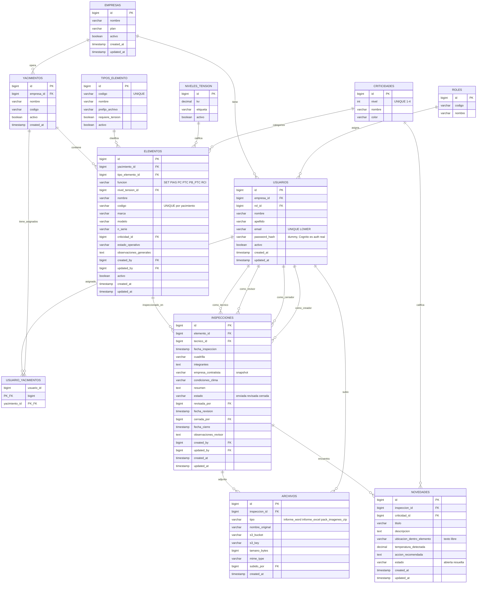
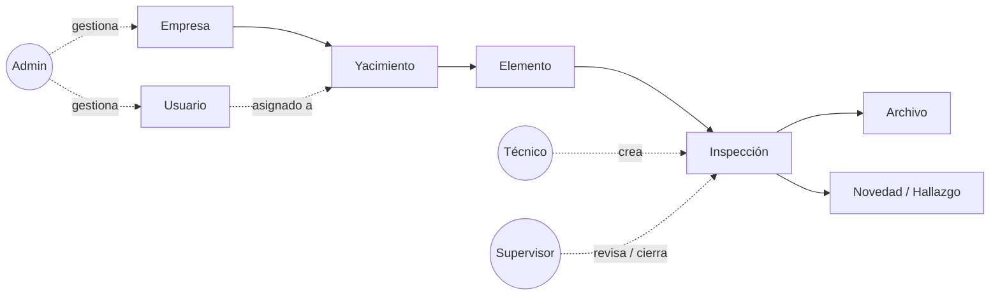
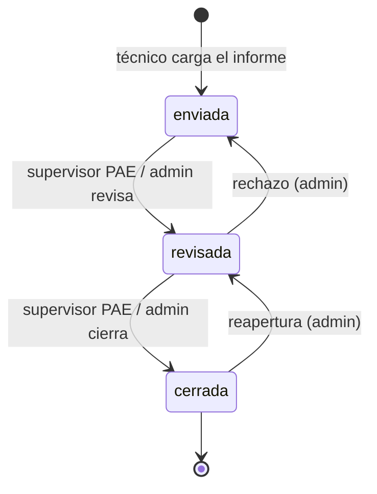
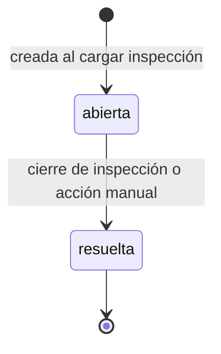

# Diagrama ER — TermoVault

> Vista entidad-relación del modelo actual. Renderizable en GitHub (Mermaid) o cualquier viewer que soporte `mermaid` blocks.

## Diagrama principal



## Diagrama simplificado (flujo de negocio)

Para discusiones de producto sin detalle de columnas:



## Diagrama de estados — Inspección



Notas:

- `enviada` es el estado inicial (no hay `borrador` desde la migración `2026_05_27_000001`).
- Al pasar a `cerrada`, todas las novedades en estado `abierta` se actualizan a `resuelta` (ver `InspeccionController::updateEstado`).
- Las transiciones de reapertura/rechazo no están explícitamente en el código actual pero están permitidas por la CHECK constraint `chk_inspecciones_estado`.

## Diagrama de estados — Novedad



CHECK constraint `chk_novedades_estado` solo permite `abierta` y `resuelta`.

## Notas

- **Cardinalidades**: `||` = exactamente uno, `o{` = cero o más, `o|` = cero o uno.
- **`USUARIOS` aparece 4 veces** del lado de `INSPECCIONES` porque la misma tabla cubre cuatro roles distintos en la inspección: técnico, revisor, cerrador y creador. Mermaid permite múltiples relaciones entre las mismas tablas con etiquetas diferentes.
- **`empresa_contratista` no es FK**: es un snapshot textual del nombre de la empresa al momento de crear la inspección. Decisión registrada en ADR-011.
- **`ubicacion_dentro_elemento` es texto libre**: la DB no modela los puntos internos (bushings, campos) — esos viven dentro del Word.

## Para mantener el diagrama

- Si una migración agrega/quita una columna o tabla, **actualizar este archivo** en el mismo PR.
- Para regenerar el diagrama a partir del schema real:
  ```bash
  docker compose exec postgres pg_dump -s -U termovault termovault > /tmp/schema.sql
  # cargar a https://dbdiagram.io o usar mermaidchart.com con la opción "import"
  ```
